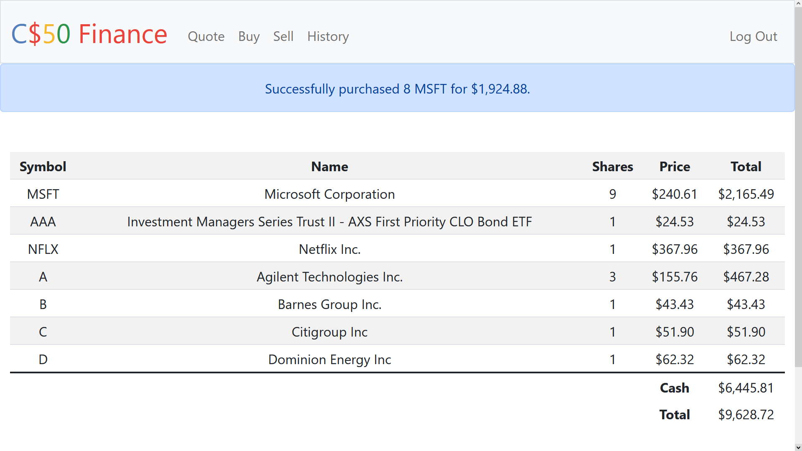
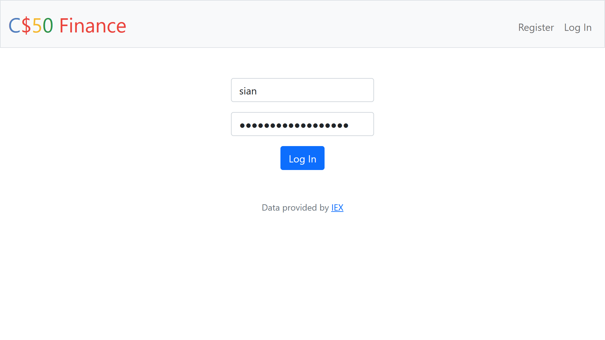
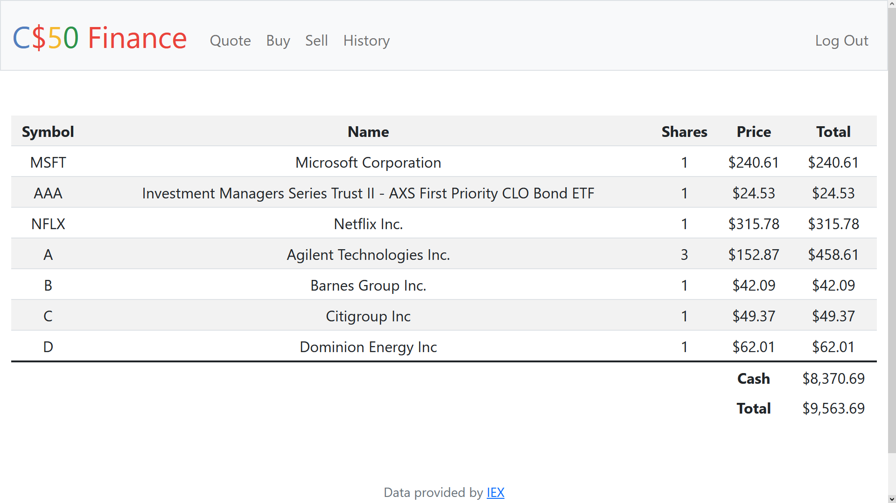
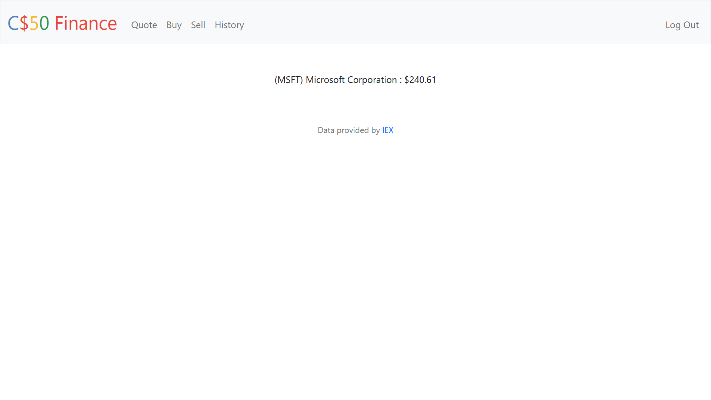
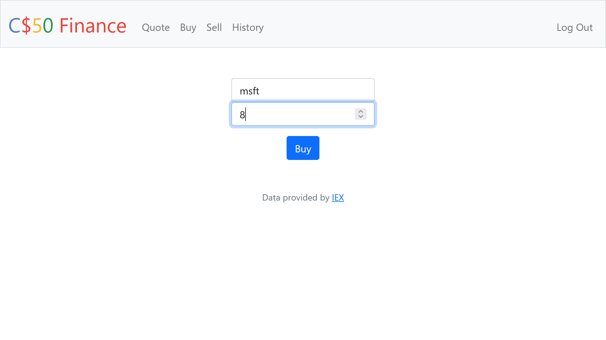
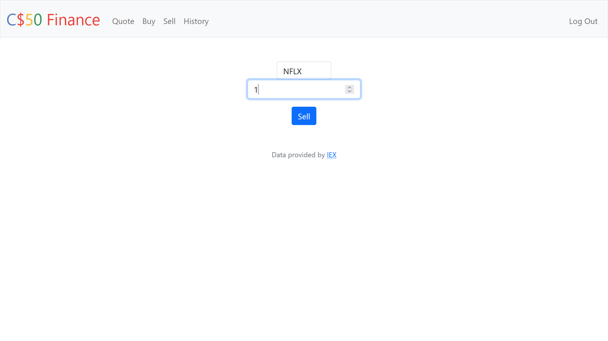
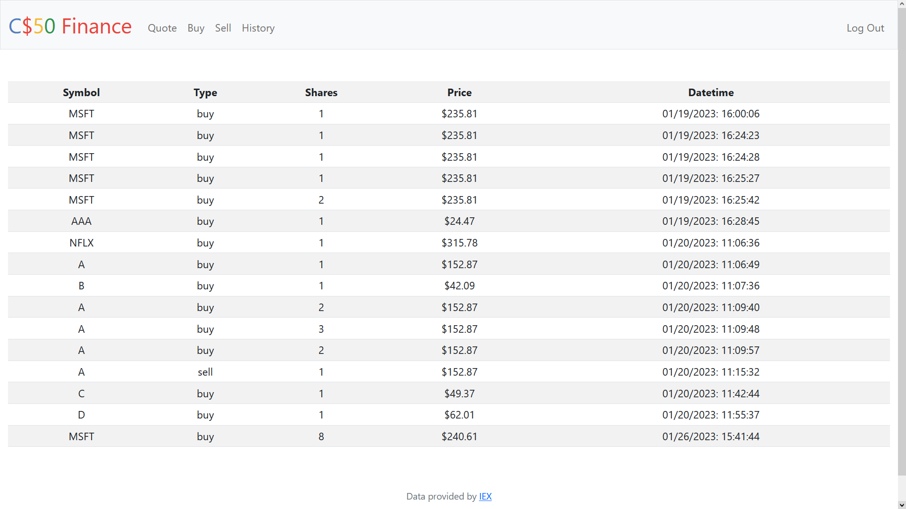

# Finance: a Stock Portfolio Web App

Problem Set Solution for CS50 2022 Week 9

## Summary
Finance is a web app where you can manage stocks. It allows real time checking of stock prices, purchasing and selling stocks by utilizing IEX API.

## Technologies
* Python (flask)
* SQL (sqlite3)
* HTML
* CSS
* Bootstrap

## How to Run
1. Fork and clone this repository.
2. Navigate to the project directory.
3. Setup and activate a Flask environment.
4. Visit <a href="https://iexcloud.io/">IEX Cloud</a>, register an individual account and copy the Token (starts with "pk_").
4. Export the token to your environment as API_KEY=<token>
5. Run Flask

## Specification

### Register
Contains a form that allows user to register for and login to an account

### Index
Homepage displaying the real-time value of the user portfolio

### Quote
Contains a form that allows user to check the real-time value of a valid stock

### Buy
Allows the user to buy a set amount of stock provided they have enough funds.

### Sell
Allows the user to sell a set amount of stocks they own. 

### History
Shows a table of transactions a user has completed. Contains transaction stock name, type, amount, price, and datetime.

---
[CS50 2023 pset description](https://cs50.harvard.edu/x/2023/psets/9/finance/)

The starter code is provided by CS50.
The file be found here: <a href="https://cdn.cs50.net/2022/fall/psets/9/finance.zip">ZIP file</a>
